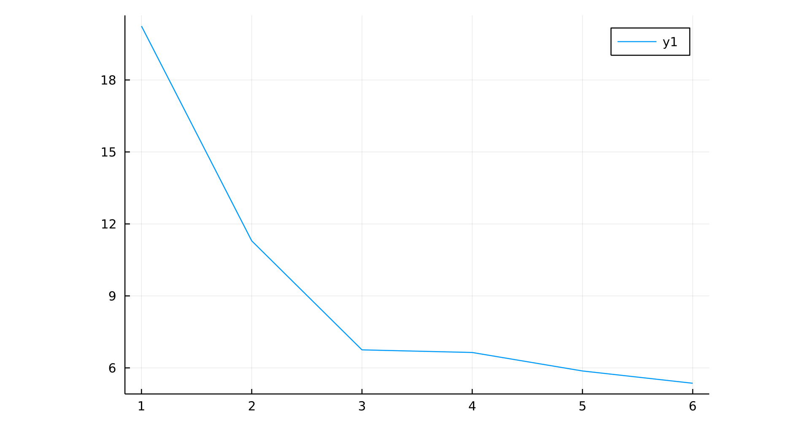

# Numerical Analysis

## 简介

在意识到学校数值分析的要求并不算太高之后，我决定开始学习Julia，首先是考虑到当前MATLAB的禁用导致在公开使用上受到限制，又因其商业性质，所以我选择支持开源。我相信自由软件是未来必然的趋势。

最初是跟随[csdiy.wiki](https://csdiy.wiki/%E6%95%B0%E5%AD%A6%E8%BF%9B%E9%98%B6/numerical/)的介绍而得知，当前跟进完成了学校的计算方法实验，同时开始对理论课程的缺漏进行补充。

目前一些有用的链接分散在各章节的notebook里面，在写实验的过程中搜集到的有用链接会在实验code目录下各个notebook中，大概在学习完成后会进行整理。

各实验的代码和报告已完成，使用`juliawin`作为portable版本提供运行环境或者使用编译后的二进制`Demo.exe`文件运行。

`juliawin`首次运行时对环境进行初始化需要联网，发布在`v1.0.0-alpha`中。

打包的二进制文件`Demo.exe`通过调用`demo.bat`脚本可以直接运行，已解决可移植性问题，发布在`v1.0.0`中。

添加`sysimage`前后的运行效率（秒）

| fully-compiled | empty     | +NLsolve  | +SymPy   | +LaTeXStrings | +PrettyTables | +Roots   |
| -------------- | --------- | --------- | -------- | ------------- | ------------- | -------- |
| 2.164228       | 20.245492 | 11.294855 | 6.751624 | 6.641936      | 5.871683      | 5.359560 |
| 2.124541       |           |           |          | 6.634245      |               |          |

## Todo

- [x] 完成各实验代码

- [x] 完成各实验report

- [x] 使用`juliawin`设置清华源，命令汇总到`.bat`文件中

- [x] 抽取最低限度需要演示的实验代码，保存到`labx-xxx.jl`文件

  > 使用`Pluto.jl`过程中遇到问题，是本身`Pluto.jl`设计所决定的，无法完全取代`Jupyter`功能，详见[这里](https://github.com/fonsp/Pluto.jl/wiki/%E2%9A%A1-Writing-and-running-code)

- [x] 编写控制演示流程的`demo.bat`文件

- [x] 在多台机器上测试运行结果
  
  > 可使用`juliawin`运行，当前版本因检测到路径变更会重新下载依赖，后续可以通过提前覆盖原路径来解决，或修改`juliawin`源码
  > 
  > 也可使用打包的二进制文件在`demo.bat`脚本的调用下运行，通过移除替换所有使用`PyCall`的代码解决了可移植性问题

- [x] (可选)使用`PackageCompiler.jl`打包二进制文件，或者预编译以避免可能需要联网的`precompile`过程

- [ ] 7月初 在写小学期实验间完成mit数值分析课程学习及其实验

## 声明

本仓库使用`GNU General Pubic License 3.0`开源协议，这意味着：

- 本仓库代码不允许商用
- 允许对代码进行分发、发布，但需要注明来源于本仓库地址
- 任何基于源代码的使用、改动仍需使用`GPL`协议，同时需注明相对于源代码版本的改动，如直接使用算法的`Julia`实现或基于原有`Julia`代码的改动等
- 对于代码内容的学习使用，如仅作学习或使用其他语言重写算法进行使用等，则不受`GPL 3.0`协议限制
