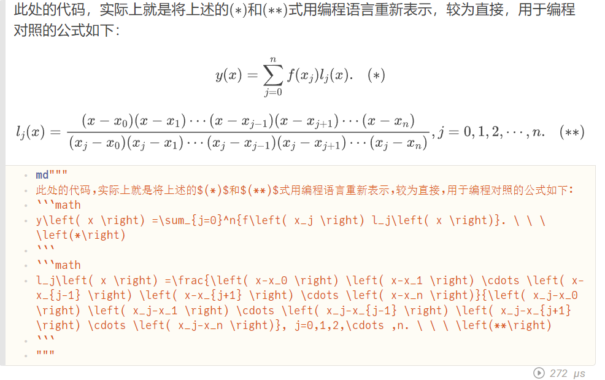

jupyter2pluto webpage  https://observablehq.com/@olivier_plas/pluto-jl-jupyter-conversion

只是对jupyter框架的转换，但不兼容的语法没有被处理，最主要就是markdown语法不兼容的问题

1. markdown $$不能被识别，需要转为```math .... ```，而这本来是一种iteral，总之就是和markdown语法是不同的
2. markdown $ 不建议被使用，因为字符串使用了perl语法嵌入变量，有时可用，有时不可用，很混乱，最好转为`` ``(double backticks)
3. julia多行代码执行的问题，变量重定义导致冲突，但jupyter能自动处理,pluto不能直接使用多行代码

代码问题已经解决，如下所示，但是是手改的，自动化改应该也不难

还有就是pluto的快捷键和jupyter以及vscode不统一，ctrl+enter本应该是保持在单元格，但在pluto中和Ctrl+enter的作用交换了

````text
md"""
此处的代码，实际上就是将上述的$(*)$和$(**)$式用编程语言重新表示，较为直接，用于编程对照的公式如下：
```math
y\left( x \right) =\sum_{j=0}^n{f\left( x_j \right) l_j\left( x \right)}. \ \ \ \left(*\right)
```
```math
l_j\left( x \right) =\frac{\left( x-x_0 \right) \left( x-x_1 \right) \cdots \left( x-x_{j-1} \right) \left( x-x_{j+1} \right) \cdots \left( x-x_n \right)}{\left( x_j-x_0 \right) \left( x_j-x_1 \right) \cdots \left( x_j-x_{j-1} \right) \left( x_j-x_{j+1} \right) \cdots \left( x_j-x_n \right)}, j=0,1,2,\cdots ,n. \ \ \ \left(**\right)
```
"""
````




