## 实验题目3 四阶龙格-库塔(Runge-Kutta)方法

本实验完成了Runge-Kutta方法的编写，充分学习了微分方程求解、(隐)函数求导库等的用法，巩固了相关理论知识。

### 实验介绍

本实验为Runge-Kutta方法实验，需要完成使用Runge-Kutta方法求解常微分方程初值问题数值解的任务，求解本次各个实验题目的问题。

本次实验过程中，主要为对Runge-Kutta方法代码完成编写，并充分体会Runge-Kutta方法的简洁性和相比于Euler方法的在准确性上的优点，同时从绘制的数值解图像注意到n的取值对于结果的重要影响。

实验的目的即为使用Runge-Kutta方法求解常微分方程初值问题的数值解。

该实验报告主要分为7个部分，大纲罗列如下：

- 实验简介：即本部分的所有内容
- **数学原理**：即常微分方程初值问题的数学定义，和对Runge-Kutta方法的基本数学原理进行阐述
- **代码实现**：使用`Julia`语言，根据数学原理，编写实验代码
- 测试代码：对程序的运行、输出进行测试的部分
  - Test 1 - Simple：使用教材上的例题对程序的正确性进行简单的测试，确保所写代码能完成实验任务。
- **实验题目**：实验指导书中所要求的完成的实验题目，作有便于对照使用Runge-Kutta方法的`lib solver`和`my solver`与真实结果`true result`的曲线图，各题目均同时使用`lib solver`和`my solver`进行求解，熟悉了`Julia`库`DifferentcialEquations`求解`ODE`问题的使用流程。
  - **执行代码**：本部分是实验代码进行运行时封装的部分，将函数的调用细节隐藏在`show_result()`函数内部，便于直接从外部使用特定参数对函数进行调用。
  - **问题1**：探究数值解法与解析解的关系，通过对于解为线性函数和非线性函数的常微分方程的数值求解，体会求出的数值解用于反推解析解的困难程度。
  - **问题2**&**问题3**：探究n的大小对于求解精度的影响，首先是问题2变化的n对于求解精度的影响几乎可以不计，很容易求得精度较高的解，而在求解问题3时过小的n却根本无法对方程进行求解。这一定程度上说明了，求解的精度和n的选取很大程度上依赖于方程本身的性质。
- **思考题**：本部分为实验指导书中所要求的完成的思考题解答
- 参考资料：本部分为完成实验过程中查阅的参考资料

### 数学原理

给定常微分方程初值问题
$$
\begin{cases}
	\frac{\mathrm{d}y}{\mathrm{d}x}=f\left( x,y \right) ,a\le x\le b\\
	y\left( a \right) =\alpha ,h=\frac{b-a}{N}\\
\end{cases}
$$
记$x_n=a+n\cdot h,n=0,1,...,N$，利用四阶Runge-Kutta方法，有
$$
\begin{aligned}
K_1&=h\cdot f\left( x_n,y_n \right) 
\\
K_2&=h\cdot f\left( x_n+\frac{h}{2},y_n+\frac{K_1}{2} \right) 
\\
K_3&=h\cdot f\left( x_n+\frac{h}{2},y_n+\frac{K_2}{2} \right) 
\\
K_4&=h\cdot f\left( x_n+h,y_n+K_3 \right) 
\\
y_{n+1}&=y_n+\frac{1}{6}\left( K_1+2K_2+2K_3+K_4 \right) ,n=0,1,...,N-1
\end{aligned}
$$
可以逐次求出微分方程初值问题的数值解$y_n,n=1,2,..,N$。

### 代码实现

首先导入需要的包。

`DifferentialEquations.jl`是用于求解微分方程的标准库，本例中用于获取`lib solver`所需的数值解；

`ImplicitEquations.jl`是用于支持隐函数的标准库，本例中仅在`Test 1 - Simple`部分用于支持绘制隐函数图像。


```julia
using DifferentialEquations
using Plots
using LaTeXStrings
using Statistics
using ImplicitEquations
using PrettyTables
```

根据数学原理和代码流程，可以很容易写出如下代码：


```julia
function rungekutta(f::Function, xspan, y0, num)
    a, b = xspan
    x0 = a
    h = (b - a) / num
    xs, ys = zeros(num), zeros(num)
    for n = 1:num
        K1 = h * f(x0, y0)
        K2 = h * f(x0 + h / 2, y0 + K1 / 2)
        K3 = h * f(x0 + h / 2, y0 + K2 / 2)
        K4 = h * f(x0 + h, y0 + K3)
        x1 = x0 + h
        y1 = y0 + 1 / 6 * (K1 + 2K2 + 2K3 + K4)
        xs[n], ys[n] = x0, y0 = x1, y1
    end
    xs, ys
end
```

### 测试代码

这是一段从教材上选取的测试代码。

待求微分方程为$\frac{\mathrm{d} y}{\mathrm{d} x}=y-\frac{2x}{y}$，解析解为抛物线$y^2=2x+1$，编写的`rungekutta()`函数进行数值求解时只求解了$y>0$的情形。

除此以外，调用`DifferentialEquations.jl`库中经`ODEProblem()`返回类型重载了的`solve()`方法获得了更精确的数值解。

因本部分仅做测试用，运行过程未经过封装，略显零乱，但考虑到与本实验问题求解并无直接关联，故未作更多修改。

#### Test 1 - Simple


```julia
f(y, p, x) = y - 2x / y
xspan = (0.0, 1.0)
y0 = 1.0
prob = ODEProblem(f, y0, xspan)
alg = RK4()
sol = solve(prob, alg, reltol=1e-8, abstol=1e-8)
plot(title=L"~~~~~~~~~~~~ Problem:\ \frac{\mathrm{d} y}{\mathrm{d} x}=y-\frac{2x}{y}")
plot!(sol.t, sol.u, seriestype=:scatter, markersize=3, msw=0, color=:red, label="lib solver")

f(x, y) = y - 2x / y
# xspan = (0.0, 1.0)
# y0 = 1.0
println("My Runge-Kutta Solver:")
num = convert(Integer, 1.0 / 0.2)
xs, ys = rungekutta(f, xspan, y0, 5)
yt = .√(2 .* xs .+1)
data = [xs yt ys]
header = (["x","True y", "Pred y"])
pretty_table(
    data;
    alignment=[:c, :c, :c],
    header=header,
    header_crayon=crayon"bold",
    # tf = tf_markdown,
    formatters=ft_printf("%14.8f"))
p = plot!(xs, ys, seriestype=:scatter, markersize=5, msw=0, color=:green, label="my solver")
# display(p)
f(x, y) = y^2 - 2x - 1
p = plot!(f ⩵ 0.0, color=:green, linewidth=0.1, label="true result")  # \Equal[Tab]
p = plot!(legend=:outertopright, xlim=(-0.51, 1.53), ylim=(-1.9, 1.9))
x = xlims(p)[2]
y = mean(ylims(p))
ymax = ylims(p)[2]
annotate!(x, y, L"y^2=2x+1", :black)
display(p)
```

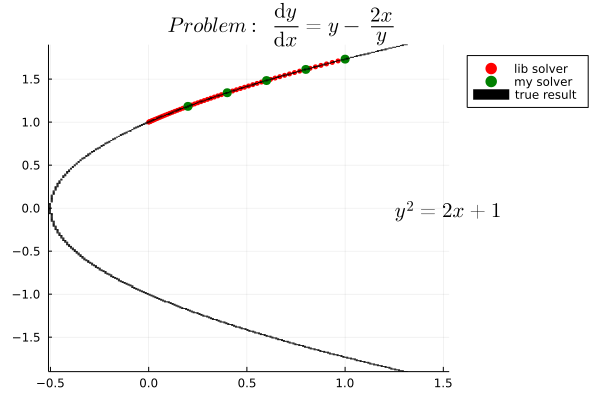


```
My Runge-Kutta Solver:
┌────────────────┬────────────────┬────────────────┐
│       x        │     True y     │     Pred y     │
├────────────────┼────────────────┼────────────────┤
│     0.20000000 │     1.18321596 │     1.18322929 │
│     0.40000000 │     1.34164079 │     1.34166693 │
│     0.60000000 │     1.48323970 │     1.48328146 │
│     0.80000000 │     1.61245155 │     1.61251404 │
│     1.00000000 │     1.73205081 │     1.73214188 │
└────────────────┴────────────────┴────────────────┘
```

### 实验题目

#### 执行代码

本部分代码用于将需要呈现的结果封装在一个`show_result()`函数中，作图时调用重载的三个作图函数`show_plot()`，分别绘制出`lib solver`，`my solver`和`true result`的图像，用于观察结果。在运行的循环中，打印出每次执行时的数据，以表格方式呈现。

在本部分之后，是各个问题的逐一求解过程，因题目本身不带更多条件，为标准的常微分方程初值问题求解，故仅按部就班完成了代码的编写和求解，以及结果展示。

为便于区分题目，所绘制的图像中给出了题目的微分方程和标准解的解析式，可供参考。考虑到图片整洁性的原因，略去对于x范围和初值的呈现，前者可直接从x轴范围看出，后者可从标准解的y坐标大致读出。


```julia
function show_plot(p, f::Function, tspan, u0::Float64, reltol, abstol, dense::Bool)
    prob = ODEProblem(f, u0, tspan)
    alg = RK4()
    sol = solve(prob, alg, reltol=1e-8, abstol=1e-8)
    if dense
        p = plot!(sol, seriestype=:scatter, markersize=1, msw=0, color=:red, label="lib solver")
    else
        p = plot!(sol.t, sol.u, seriestype=:scatter, markersize=2, msw=0, color=:red, label="lib solver")
    end
    p, sol
end
function show_plot(p, f::Function, xspan, y0::Float64, iternum::Integer)
    xs, ys = rungekutta(f, xspan, y0, iternum)
    p = plot!(xs, ys, seriestype=:scatter, markersize=4, msw=0, color=:green, label="my solver")
    p, xs, ys
end
function show_plot(p, f::Function, xs, show::Bool, text)
    x = xlims(p)[2]
    y = mean(ylims(p))
    annotate!(x, y, text, :black)
    if show
        p = plot!(f, color=:blue, label="true result")
    else
        p = plot!(f, color=:blue, label="true result")
    end
    p, xs, f.(xs)
end
function show_result(f1::Function, f2::Function, f3::Function, xspan, y0, iternums, show::Bool, dense::Bool, title, text)
    println("\n\n" * title)
    for iternum in iternums
        print("\nIternum: $iternum\n")
        p = plot(legend=:outertopright, title=L"~~~~~~~~~~~~~~~~~~~~" * title)
        p, sol = show_plot(p, f1, xspan, y0, 1e-8, 1e-8, dense)
        p, xs, ys = show_plot(p, f2, xspan, y0, iternum)
        p, xt, yt = show_plot(p, f3, xs, show, text)
        data = [xt yt ys]
        header = (["x", "True y", "Pred y"])
        pretty_table(
            data;
            alignment=[:c, :c, :c],
            header=header,
            header_crayon=crayon"bold",
            # tf = tf_markdown,
            formatters=ft_printf("%14.8f"))
        display(p)
    end
end
```


#### 问题 1

##### 1.1

$Problem\ 1.1\ \frac{\mathrm{d} y}{\mathrm{d} x} = x + y$


```julia
iternums = [5, 10, 20]

f1(y, p, x) = x + y    # lib RK4() solver
xspan = (0.0, 1.0)
y0 = -1.0
f2(x, y) = x + y       # my rungekutta() solver
f3(x) = -x - 1         # true result 
title = L"Problem\ 1.1: \frac{\mathrm{d} y}{\mathrm{d} x} = x + y"
text = L"y = -x - 1"
show_result(f1, f2, f3, xspan, y0, iternums, true, true, title, text) # show=true, dense=true
```

<center>
    <figure>
        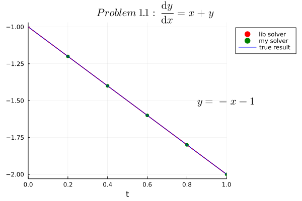     
        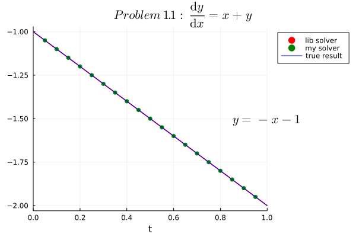
    </figure>
</center>
```
Iternum: 5
┌────────────────┬────────────────┬────────────────┐
│       x        │     True y     │     Pred y     │
├────────────────┼────────────────┼────────────────┤
│     0.20000000 │    -1.20000000 │    -1.20000000 │
│     0.40000000 │    -1.40000000 │    -1.40000000 │
│     0.60000000 │    -1.60000000 │    -1.60000000 │
│     0.80000000 │    -1.80000000 │    -1.80000000 │
│     1.00000000 │    -2.00000000 │    -2.00000000 │
└────────────────┴────────────────┴────────────────┘

Iternum: 10
┌────────────────┬────────────────┬────────────────┐
│       x        │     True y     │     Pred y     │
├────────────────┼────────────────┼────────────────┤
│     0.10000000 │    -1.10000000 │    -1.10000000 │
│     0.20000000 │    -1.20000000 │    -1.20000000 │
│     0.30000000 │    -1.30000000 │    -1.30000000 │
│     0.40000000 │    -1.40000000 │    -1.40000000 │
│     0.50000000 │    -1.50000000 │    -1.50000000 │
│     0.60000000 │    -1.60000000 │    -1.60000000 │
│     0.70000000 │    -1.70000000 │    -1.70000000 │
│     0.80000000 │    -1.80000000 │    -1.80000000 │
│     0.90000000 │    -1.90000000 │    -1.90000000 │
│     1.00000000 │    -2.00000000 │    -2.00000000 │
└────────────────┴────────────────┴────────────────┘

Iternum: 20
┌────────────────┬────────────────┬────────────────┐
│       x        │     True y     │     Pred y     │
├────────────────┼────────────────┼────────────────┤
│     0.05000000 │    -1.05000000 │    -1.05000000 │
│     0.10000000 │    -1.10000000 │    -1.10000000 │
│     0.15000000 │    -1.15000000 │    -1.15000000 │
│     0.20000000 │    -1.20000000 │    -1.20000000 │
│     0.25000000 │    -1.25000000 │    -1.25000000 │
│     0.30000000 │    -1.30000000 │    -1.30000000 │
│     0.35000000 │    -1.35000000 │    -1.35000000 │
│     0.40000000 │    -1.40000000 │    -1.40000000 │
│     0.45000000 │    -1.45000000 │    -1.45000000 │
│     0.50000000 │    -1.50000000 │    -1.50000000 │
│     0.55000000 │    -1.55000000 │    -1.55000000 │
│     0.60000000 │    -1.60000000 │    -1.60000000 │
│     0.65000000 │    -1.65000000 │    -1.65000000 │
│     0.70000000 │    -1.70000000 │    -1.70000000 │
│     0.75000000 │    -1.75000000 │    -1.75000000 │
│     0.80000000 │    -1.80000000 │    -1.80000000 │
│     0.85000000 │    -1.85000000 │    -1.85000000 │
│     0.90000000 │    -1.90000000 │    -1.90000000 │
│     0.95000000 │    -1.95000000 │    -1.95000000 │
│     1.00000000 │    -2.00000000 │    -2.00000000 │
└────────────────┴────────────────┴────────────────┘
```

##### 1.2

$Problem\ 1.2\ \frac{\mathrm{d} y}{\mathrm{d} x} = -y^2$


```julia
iternums = [5, 10, 20]

f1(y, p, x) = -y^2
xspan = (0.0, 1.0)
y0 = 1.0
f2(x, y) = -y^2
f3(x) = 1 / (x + 1)
title = L"Problem\ 1.2: \frac{\mathrm{d} y}{\mathrm{d} x} = -y^2"
text = L"y = \frac{1}{x + 1}"
show_result(f1, f2, f3, xspan, y0, iternums, true, false, title, text) # show=true, dense=true
```

<center>
    <figure>
        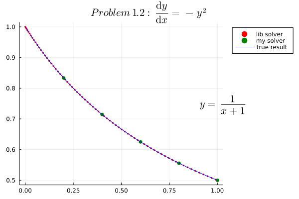
        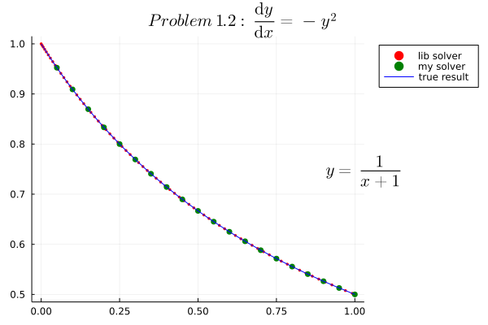
    </figure>
</center>
```
Iternum: 5
┌────────────────┬────────────────┬────────────────┐
│       x        │     True y     │     Pred y     │
├────────────────┼────────────────┼────────────────┤
│     0.20000000 │     0.83333333 │     0.83333904 │
│     0.40000000 │     0.71428571 │     0.71429213 │
│     0.60000000 │     0.62500000 │     0.62500589 │
│     0.80000000 │     0.55555556 │     0.55556069 │
│     1.00000000 │     0.50000000 │     0.50000441 │
└────────────────┴────────────────┴────────────────┘

Iternum: 10
┌────────────────┬────────────────┬────────────────┐
│       x        │     True y     │     Pred y     │
├────────────────┼────────────────┼────────────────┤
│     0.10000000 │     0.90909091 │     0.90909119 │
│     0.20000000 │     0.83333333 │     0.83333373 │
│     0.30000000 │     0.76923077 │     0.76923121 │
│     0.40000000 │     0.71428571 │     0.71428615 │
│     0.50000000 │     0.66666667 │     0.66666709 │
│     0.60000000 │     0.62500000 │     0.62500040 │
│     0.70000000 │     0.58823529 │     0.58823567 │
│     0.80000000 │     0.55555556 │     0.55555590 │
│     0.90000000 │     0.52631579 │     0.52631611 │
│     1.00000000 │     0.50000000 │     0.50000030 │
└────────────────┴────────────────┴────────────────┘

Iternum: 20
┌────────────────┬────────────────┬────────────────┐
│       x        │     True y     │     Pred y     │
├────────────────┼────────────────┼────────────────┤
│     0.05000000 │     0.95238095 │     0.95238096 │
│     0.10000000 │     0.90909091 │     0.90909093 │
│     0.15000000 │     0.86956522 │     0.86956524 │
│     0.20000000 │     0.83333333 │     0.83333336 │
│     0.25000000 │     0.80000000 │     0.80000003 │
│     0.30000000 │     0.76923077 │     0.76923080 │
│     0.35000000 │     0.74074074 │     0.74074077 │
│     0.40000000 │     0.71428571 │     0.71428574 │
│     0.45000000 │     0.68965517 │     0.68965520 │
│     0.50000000 │     0.66666667 │     0.66666669 │
│     0.55000000 │     0.64516129 │     0.64516132 │
│     0.60000000 │     0.62500000 │     0.62500003 │
│     0.65000000 │     0.60606061 │     0.60606063 │
│     0.70000000 │     0.58823529 │     0.58823532 │
│     0.75000000 │     0.57142857 │     0.57142859 │
│     0.80000000 │     0.55555556 │     0.55555558 │
│     0.85000000 │     0.54054054 │     0.54054056 │
│     0.90000000 │     0.52631579 │     0.52631581 │
│     0.95000000 │     0.51282051 │     0.51282053 │
│     1.00000000 │     0.50000000 │     0.50000002 │
└────────────────┴────────────────┴────────────────┘
```


#### 问题 2

##### 2.1

$Problem\ 2.1\ \frac{\mathrm{d} y}{\mathrm{d} x}=\frac{2y}{x}+x^2 e^x$


```julia
iternums = [5, 10, 20]

f1(y, p, x) = 2 * y / x + x^2 * exp(x)
xspan = (1.0, 3.0)
y0 = 0.0
f2(x, y) = 2 * y / x + x^2 * exp(x)
f3(x) = x^2 * (exp(x) - exp(1))
title = L"Problem\ 2.1:\frac{\mathrm{d} y}{\mathrm{d} x}=\frac{2y}{x}+x^2 e^x"
text = L"y=x^2(e^x - e)"
show_result(f1, f2, f3, xspan, y0, iternums, true, false, title, text) # show=true, dense=true
```


<center>
    <figure>
        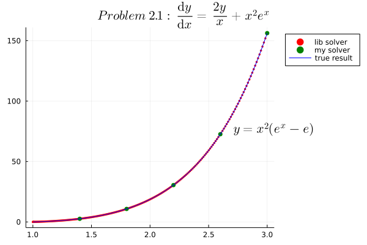        
        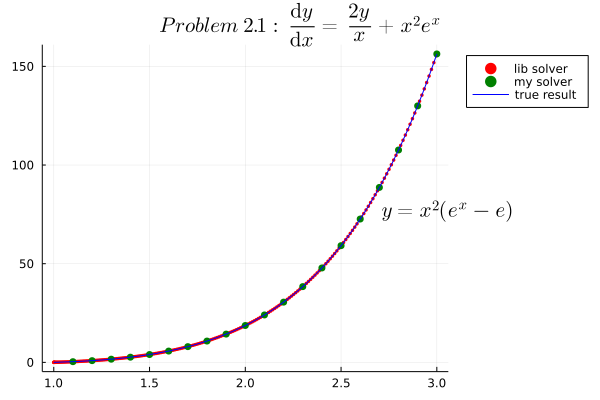
    </figure>
</center>


```
Iternum: 5
┌────────────────┬────────────────┬────────────────┐
│       x        │     True y     │     Pred y     │
├────────────────┼────────────────┼────────────────┤
│     1.40000000 │     2.62035955 │     2.61394279 │
│     1.80000000 │    10.79362466 │    10.77631317 │
│     2.20000000 │    30.52458129 │    30.49165420 │
│     2.60000000 │    72.63928396 │    72.58559861 │
│     3.00000000 │   156.30529585 │   156.22519828 │
└────────────────┴────────────────┴────────────────┘

Iternum: 10
┌────────────────┬────────────────┬────────────────┐
│       x        │     True y     │     Pred y     │
├────────────────┼────────────────┼────────────────┤
│     1.20000000 │     0.86664254 │     0.86637911 │
│     1.40000000 │     2.62035955 │     2.61974052 │
│     1.60000000 │     5.72096153 │     5.71989528 │
│     1.80000000 │    10.79362466 │    10.79201760 │
│     2.00000000 │    18.68309708 │    18.68085236 │
│     2.20000000 │    30.52458129 │    30.52159814 │
│     2.40000000 │    47.83619262 │    47.83236583 │
│     2.60000000 │    72.63928396 │    72.63450354 │
│     2.80000000 │   107.61470115 │   107.60885199 │
│     3.00000000 │   156.30529585 │   156.29825744 │
└────────────────┴────────────────┴────────────────┘

Iternum: 20
┌────────────────┬────────────────┬────────────────┐
│       x        │     True y     │     Pred y     │
├────────────────┼────────────────┼────────────────┤
│     1.10000000 │     0.34591988 │     0.34591029 │
│     1.20000000 │     0.86664254 │     0.86662169 │
│     1.30000000 │     1.60721508 │     1.60718135 │
│     1.40000000 │     2.62035955 │     2.62031131 │
│     1.50000000 │     3.96766629 │     3.96760190 │
│     1.60000000 │     5.72096153 │     5.72087932 │
│     1.70000000 │     7.96387348 │     7.96377179 │
│     1.80000000 │    10.79362466 │    10.79350178 │
│     1.90000000 │    14.32308154 │    14.32293573 │
│     2.00000000 │    18.68309708 │    18.68292657 │
│     2.10000000 │    24.02518645 │    24.02498942 │
│     2.20000000 │    30.52458129 │    30.52435589 │
│     2.30000000 │    38.38371431 │    38.38345866 │
│     2.40000000 │    47.83619262 │    47.83590478 │
│     2.50000000 │    59.15132583 │    59.15100383 │
│     2.60000000 │    72.63928396 │    72.63892578 │
│     2.70000000 │    88.65696974 │    88.65657333 │
│     2.80000000 │   107.61470115 │   107.61426439 │
│     2.90000000 │   129.98381238 │   129.98333312 │
│     3.00000000 │   156.30529585 │   156.30477188 │
└────────────────┴────────────────┴────────────────┘
```


##### 2.2

$Problem\ 2.2\ \frac{\mathrm{d} y}{\mathrm{d} x}=\frac{1}{x}(y^2+y)$


```julia
iternums = [5, 10, 20]

f1(y, p, x) = (y^2 + y) / x
xspan = (1.0, 3.0)
y0 = -2.0
f2(x, y) = (y^2 + y) / x
f3(x) = 2x / (1 - 2x)
title = L"Problem\ 2.2:\frac{\mathrm{d} y}{\mathrm{d} x}=\frac{1}{x}(y^2+y)"
text = L"y=\frac{2x}{1-2x}"
show_result(f1, f2, f3, xspan, y0, iternums, true, false, title, text) # show=true, dense=true
```


<center>
    <figure>
        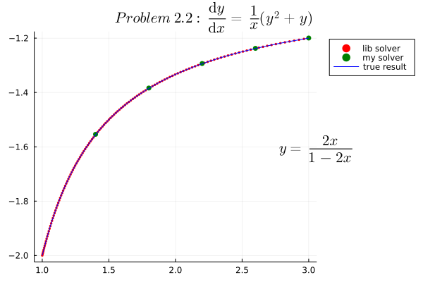
        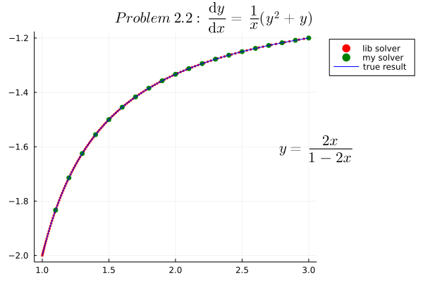
    </figure>
</center>


```
Iternum: 5
┌────────────────┬────────────────┬────────────────┐
│       x        │     True y     │     Pred y     │
├────────────────┼────────────────┼────────────────┤
│     1.40000000 │    -1.55555556 │    -1.55398900 │
│     1.80000000 │    -1.38461538 │    -1.38361729 │
│     2.20000000 │    -1.29411765 │    -1.29340153 │
│     2.60000000 │    -1.23809524 │    -1.23754016 │
│     3.00000000 │    -1.20000000 │    -1.19954796 │
└────────────────┴────────────────┴────────────────┘

Iternum: 10
┌────────────────┬────────────────┬────────────────┐
│       x        │     True y     │     Pred y     │
├────────────────┼────────────────┼────────────────┤
│     1.20000000 │    -1.71428571 │    -1.71424518 │
│     1.40000000 │    -1.55555556 │    -1.55552288 │
│     1.60000000 │    -1.45454545 │    -1.45451975 │
│     1.80000000 │    -1.38461538 │    -1.38459451 │
│     2.00000000 │    -1.33333333 │    -1.33331586 │
│     2.20000000 │    -1.29411765 │    -1.29410266 │
│     2.40000000 │    -1.26315789 │    -1.26314480 │
│     2.60000000 │    -1.23809524 │    -1.23808362 │
│     2.80000000 │    -1.21739130 │    -1.21738087 │
│     3.00000000 │    -1.20000000 │    -1.19999054 │
└────────────────┴────────────────┴────────────────┘

Iternum: 20
┌────────────────┬────────────────┬────────────────┐
│       x        │     True y     │     Pred y     │
├────────────────┼────────────────┼────────────────┤
│     1.10000000 │    -1.83333333 │    -1.83333283 │
│     1.20000000 │    -1.71428571 │    -1.71428517 │
│     1.30000000 │    -1.62500000 │    -1.62499950 │
│     1.40000000 │    -1.55555556 │    -1.55555511 │
│     1.50000000 │    -1.50000000 │    -1.49999961 │
│     1.60000000 │    -1.45454545 │    -1.45454510 │
│     1.70000000 │    -1.41666667 │    -1.41666635 │
│     1.80000000 │    -1.38461538 │    -1.38461510 │
│     1.90000000 │    -1.35714286 │    -1.35714260 │
│     2.00000000 │    -1.33333333 │    -1.33333309 │
│     2.10000000 │    -1.31250000 │    -1.31249978 │
│     2.20000000 │    -1.29411765 │    -1.29411744 │
│     2.30000000 │    -1.27777778 │    -1.27777759 │
│     2.40000000 │    -1.26315789 │    -1.26315771 │
│     2.50000000 │    -1.25000000 │    -1.24999983 │
│     2.60000000 │    -1.23809524 │    -1.23809508 │
│     2.70000000 │    -1.22727273 │    -1.22727258 │
│     2.80000000 │    -1.21739130 │    -1.21739116 │
│     2.90000000 │    -1.20833333 │    -1.20833320 │
│     3.00000000 │    -1.20000000 │    -1.19999987 │
└────────────────┴────────────────┴────────────────┘
```


#### 问题 3

##### 3.1

$Problem\ 3.1\ \frac{\mathrm{d} y}{\mathrm{d} x}=-20(y-x^2)+2x$


```julia
iternums = [5, 7, 10, 20]  # 为观察方便，添加了n=7的作图，表格数据仍为所求[5, 10, 20]

f1(y, p, x) = -20(y - x^2) + 2x
xspan = (0.0, 1.0)
y0 = 1 / 3
f2(x, y) = -20(y - x^2) + 2x
f3(x) = x^2 + 1 / 3 * exp(-20x)
title = L"Problem\ 3.1: \frac{\mathrm{d} y}{\mathrm{d} x}=-20(y-x^2)+2x"
text = L"y=x^2+\frac{1}{3}e^{-20x}"
show_result(f1, f2, f3, xspan, y0, iternums, true, false, title, text) # show=true, dense=true
```

<center>
    <figure>
        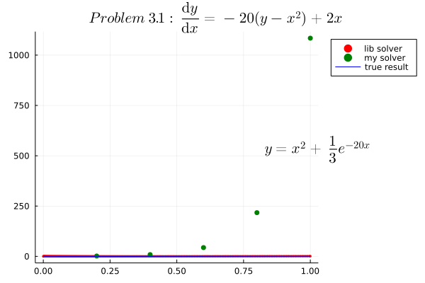
        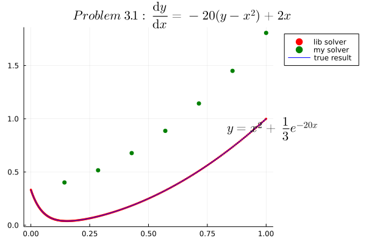
    </figure>
</center>


<center>
    <figure>
        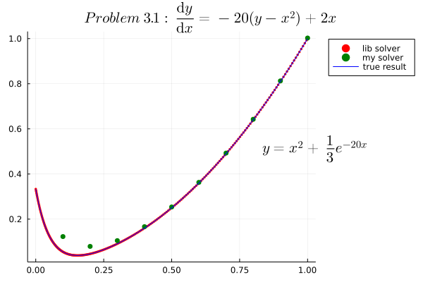
        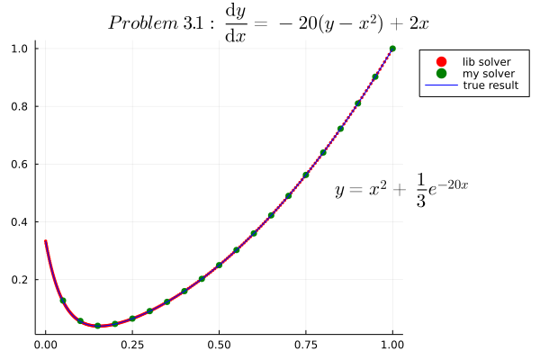
    </figure>
</center>


```
Iternum: 5
┌────────────────┬────────────────┬────────────────┐
│       x        │     True y     │     Pred y     │
├────────────────┼────────────────┼────────────────┤
│     0.20000000 │     0.04610521 │     1.76000000 │
│     0.40000000 │     0.16011182 │     8.81333333 │
│     0.60000000 │     0.36000205 │    43.68000000 │
│     0.80000000 │     0.64000004 │   217.29333333 │
│     1.00000000 │     1.00000000 │  1084.32000000 │
└────────────────┴────────────────┴────────────────┘

Iternum: 10
┌────────────────┬────────────────┬────────────────┐
│       x        │     True y     │     Pred y     │
├────────────────┼────────────────┼────────────────┤
│     0.10000000 │     0.05511176 │     0.12277778 │
│     0.20000000 │     0.04610521 │     0.07925926 │
│     0.30000000 │     0.09082625 │     0.10475309 │
│     0.40000000 │     0.16011182 │     0.16658436 │
│     0.50000000 │     0.25001513 │     0.25386145 │
│     0.60000000 │     0.36000205 │     0.36295382 │
│     0.70000000 │     0.49000028 │     0.49265127 │
│     0.80000000 │     0.64000004 │     0.64255042 │
│     0.90000000 │     0.81000001 │     0.81251681 │
│     1.00000000 │     1.00000000 │     1.00250560 │
└────────────────┴────────────────┴────────────────┘

Iternum: 20
┌────────────────┬────────────────┬────────────────┐
│       x        │     True y     │     Pred y     │
├────────────────┼────────────────┼────────────────┤
│     0.05000000 │     0.12512648 │     0.12755208 │
│     0.10000000 │     0.05511176 │     0.05694661 │
│     0.15000000 │     0.03909569 │     0.04015706 │
│     0.20000000 │     0.04610521 │     0.04667348 │
│     0.25000000 │     0.06474598 │     0.06505464 │
│     0.30000000 │     0.09082625 │     0.09101007 │
│     0.35000000 │     0.12280396 │     0.12293086 │
│     0.40000000 │     0.16011182 │     0.16021366 │
│     0.45000000 │     0.20254114 │     0.20263220 │
│     0.50000000 │     0.25001513 │     0.25010166 │
│     0.55000000 │     0.30250557 │     0.30259021 │
│     0.60000000 │     0.36000205 │     0.36008591 │
│     0.65000000 │     0.42250075 │     0.42258430 │
│     0.70000000 │     0.49000028 │     0.49008370 │
│     0.75000000 │     0.56250010 │     0.56258347 │
│     0.80000000 │     0.64000004 │     0.64008338 │
│     0.85000000 │     0.72250001 │     0.72258335 │
│     0.90000000 │     0.81000001 │     0.81008334 │
│     0.95000000 │     0.90250000 │     0.90258334 │
│     1.00000000 │     1.00000000 │     1.00008333 │
└────────────────┴────────────────┴────────────────┘
```


##### 3.2

$Problem\ 3.2\ \frac{\mathrm{d} y}{\mathrm{d} x}=-20y+20\sin(x)+\cos(x)$


```julia
iternums = [5, 7, 10, 20]  # 为观察方便，添加了n=7的作图，表格数据仍为所求[5, 10, 20]

f1(y, p, x) = -20y + 20sin(x) + cos(x)
xspan = (0.0, 1.0)
y0 = 1.0
f2(x, y) = -20y + 20sin(x) + cos(x)
f3(x) = exp(-20x) + sin(x)
title = L"Problem\ 3.2: \frac{\mathrm{d} y}{\mathrm{d} x}=-20y+20\sin(x)+\cos(x)"
text =  L"y=e^{-20x}+\sin(x)"
show_result(f1, f2, f3, xspan, y0, iternums, true, false, title ,text) # show=true, dense=true
```


<center>
    <figure>
        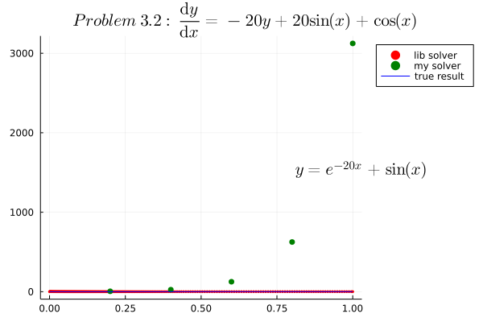
        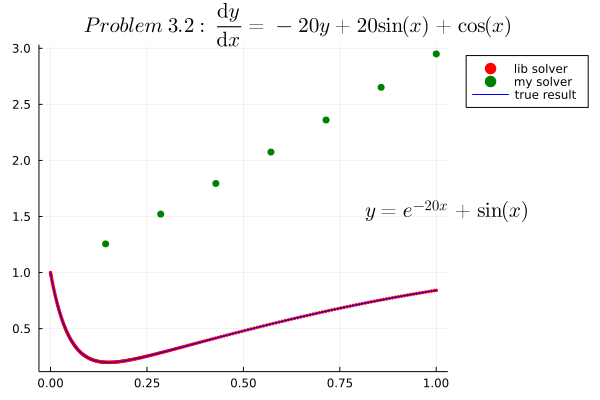
    </figure>
</center>


<center>
    <figure>
        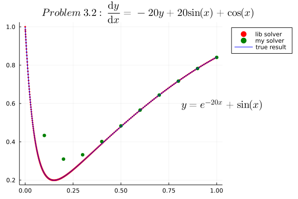
        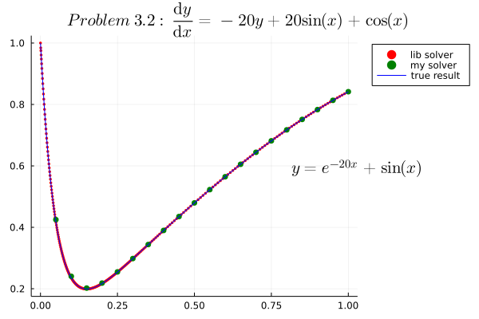
    </figure>
</center>


```   
Iternum: 5
┌────────────────┬────────────────┬────────────────┐
│       x        │     True y     │     Pred y     │
├────────────────┼────────────────┼────────────────┤
│     0.20000000 │     0.21698497 │     5.19733811 │
│     0.40000000 │     0.38975380 │    25.37617070 │
│     0.60000000 │     0.56464862 │   125.48681526 │
│     0.80000000 │     0.71735620 │   625.31209552 │
│     1.00000000 │     0.84147099 │  3123.79515095 │
└────────────────┴────────────────┴────────────────┘


Iternum: 10
┌────────────────┬────────────────┬────────────────┐
│       x        │     True y     │     Pred y     │
├────────────────┼────────────────┼────────────────┤
│     0.10000000 │     0.23516870 │     0.43313900 │
│     0.20000000 │     0.21698497 │     0.30966047 │
│     0.30000000 │     0.29799896 │     0.33232467 │
│     0.40000000 │     0.38975380 │     0.40141397 │
│     0.50000000 │     0.47947094 │     0.48307434 │
│     0.60000000 │     0.56464862 │     0.56543528 │
│     0.70000000 │     0.64421852 │     0.64398900 │
│     0.80000000 │     0.71735620 │     0.71672235 │
│     0.90000000 │     0.78332692 │     0.78249915 │
│     1.00000000 │     0.84147099 │     0.84052572 │
└────────────────┴────────────────┴────────────────┘


Iternum: 20
┌────────────────┬────────────────┬────────────────┐
│       x        │     True y     │     Pred y     │
├────────────────┼────────────────┼────────────────┤
│     0.05000000 │     0.41785861 │     0.42497852 │
│     0.10000000 │     0.23516870 │     0.24045622 │
│     0.15000000 │     0.19922520 │     0.20216844 │
│     0.20000000 │     0.21698497 │     0.21843866 │
│     0.25000000 │     0.25414191 │     0.25481165 │
│     0.30000000 │     0.29799896 │     0.29829102 │
│     0.35000000 │     0.34380969 │     0.34392855 │
│     0.40000000 │     0.38975380 │     0.38979534 │
│     0.45000000 │     0.43508894 │     0.43509617 │
│     0.50000000 │     0.47947094 │     0.47946262 │
│     0.55000000 │     0.52270393 │     0.52268809 │
│     0.60000000 │     0.56464862 │     0.56462864 │
│     0.65000000 │     0.60518867 │     0.60516599 │
│     0.70000000 │     0.64421852 │     0.64419376 │
│     0.75000000 │     0.68163907 │     0.68161253 │
│     0.80000000 │     0.71735620 │     0.71732804 │
│     0.85000000 │     0.75128045 │     0.75125076 │
│     0.90000000 │     0.78332692 │     0.78329581 │
│     0.95000000 │     0.81341551 │     0.81338305 │
│     1.00000000 │     0.84147099 │     0.84143727 │
└────────────────┴────────────────┴────────────────┘
```


##### 3.3

$Problem\ 3.3\ \frac{\mathrm{d} y}{\mathrm{d} x}=-20(y-e^x \sin(x))+e^x (\sin(x) + \cos(x))$


```julia
iternums = [5, 7, 10, 20]  # 为观察方便，添加了n=7的作图，表格数据仍为所求[5, 10, 20]

f1(y, p, x) = -20(y - exp(x)sin(x)) + exp(x) * (sin(x) + cos(x))
xspan = (0.0, 1.0)
y0 = 0.0
f2(x, y) = -20(y - exp(x)sin(x)) + exp(x) * (sin(x) + cos(x))
f3(x) = exp(x) * sin(x)
title = L"Problem\ 3.3: \frac{\mathrm{d} y}{\mathrm{d} x}=-20(y-e^x \sin(x))+e^x (\sin(x) + \cos(x))"
text = L"y=e^x \sin(x)"
show_result(f1, f2, f3, xspan, y0, iternums, true, false, title, text) # show=true, dense=true
```


<center>
    <figure>
        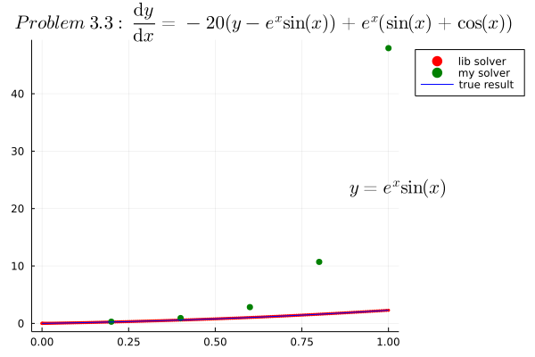
        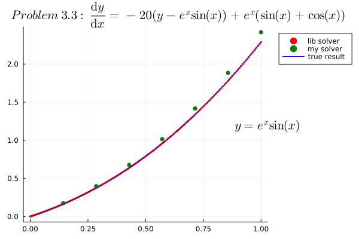
    </figure>
</center>

<center>
    <figure>
        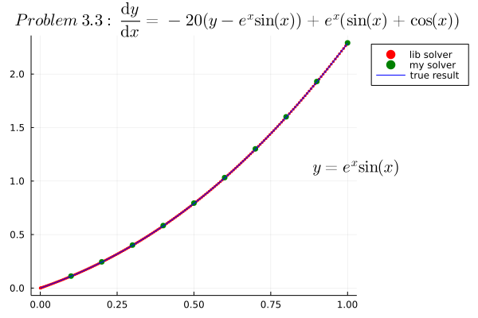
        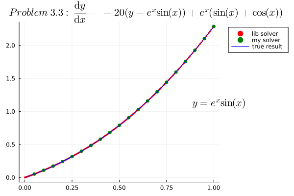
    </figure>
</center>

```
Iternum: 5
┌────────────────┬────────────────┬────────────────┐
│       x        │     True y     │     Pred y     │
├────────────────┼────────────────┼────────────────┤
│     0.20000000 │     0.24265527 │     0.29864621 │
│     0.40000000 │     0.58094390 │     0.92721987 │
│     0.60000000 │     1.02884567 │     2.83547734 │
│     0.80000000 │     1.59650534 │    10.71088533 │
│     1.00000000 │     2.28735529 │    47.94144638 │
└────────────────┴────────────────┴────────────────┘

Iternum: 10
┌────────────────┬────────────────┬────────────────┐
│       x        │     True y     │     Pred y     │
├────────────────┼────────────────┼────────────────┤
│     0.10000000 │     0.11033299 │     0.11205511 │
│     0.20000000 │     0.24265527 │     0.24511651 │
│     0.30000000 │     0.39891055 │     0.40177810 │
│     0.40000000 │     0.58094390 │     0.58409696 │
│     0.50000000 │     0.79043908 │     0.79382205 │
│     0.60000000 │     1.02884567 │     1.03241831 │
│     0.70000000 │     1.29729511 │     1.30101499 │
│     0.80000000 │     1.59650534 │     1.60032101 │
│     0.90000000 │     1.92667330 │     1.93052103 │
│     1.00000000 │     2.28735529 │     2.29115692 │
└────────────────┴────────────────┴────────────────┘

Iternum: 20
┌────────────────┬────────────────┬────────────────┐
│       x        │     True y     │     Pred y     │
├────────────────┼────────────────┼────────────────┤
│     0.05000000 │     0.05254166 │     0.05259504 │
│     0.10000000 │     0.11033299 │     0.11040899 │
│     0.15000000 │     0.17362234 │     0.17370939 │
│     0.20000000 │     0.24265527 │     0.24274900 │
│     0.25000000 │     0.31767297 │     0.31777169 │
│     0.30000000 │     0.39891055 │     0.39901355 │
│     0.35000000 │     0.48659515 │     0.48670207 │
│     0.40000000 │     0.58094390 │     0.58105449 │
│     0.45000000 │     0.68216175 │     0.68227577 │
│     0.50000000 │     0.79043908 │     0.79055629 │
│     0.55000000 │     0.90594922 │     0.90606933 │
│     0.60000000 │     1.02884567 │     1.02896834 │
│     0.65000000 │     1.15925927 │     1.15938414 │
│     0.70000000 │     1.29729511 │     1.29742175 │
│     0.75000000 │     1.44302927 │     1.44315720 │
│     0.80000000 │     1.59650534 │     1.59663402 │
│     0.85000000 │     1.75773083 │     1.75785967 │
│     0.90000000 │     1.92667330 │     1.92680163 │
│     0.95000000 │     2.10325633 │     2.10338342 │
│     1.00000000 │     2.28735529 │     2.28748035 │
└────────────────┴────────────────┴────────────────┘
```


### 思考题


1. 对实验 1，数值解和解析解相同吗？为什么？试加以说明。
   
   对于问题1.1，数值解和解析解是相同的，因为本题的解是线性函数，能够通过所得数值解的两个点确定直线的方程，即等价于得到了解析解。
   
   本例中，待求解微分方程为$\frac{\mathrm{d} y}{\mathrm{d} x} = x + y$，解为$y = -x - 1$，而`rungekutta()`函数求解的任意两点（如`(0.2,-1.2)`, `(1.0,-2.0)`）所决定的直线方程即为$y = -x - 1$。
   
   而对于问题1.2，虽然数值解和解析解之间差异已经极小（绝对误差在1e-7~1e-5数量级，仅仅对比相同x所在的y取值，如下表所示），但对于非线性函数$y=\frac{1}{1+x}$，在未知函数解析式类型的情况下，是几乎不可能仅仅通过数值解所求得的点来推断准确的函数解析式的，此时不能认为所求得的数值解就是解析解。
   ```
   ┌────────────────┬────────────────┬────────────────┬────────────────┬────────────────┐
   │     Test x     │     True y     │ 5-Iter Pred y  │ 10-Iter Pred y │ 20-Iter Pred y │
   ├────────────────┼────────────────┼────────────────┼────────────────┼────────────────┤
   │     0.20000000 │     0.83333333 │     0.83333904 │     0.83333373 │     0.83333336 │
   │     0.40000000 │     0.71428571 │     0.71429213 │     0.71428615 │     0.71428574 │
   │     0.60000000 │     0.62500000 │     0.62500589 │     0.62500040 │     0.62500003 │
   │     0.80000000 │     0.55555556 │     0.55556069 │     0.55555590 │     0.55555558 │
   │     1.00000000 │     0.50000000 │     0.50000441 │     0.50000030 │     0.50000002 │
   └────────────────┴────────────────┴────────────────┴────────────────┴────────────────┘
   ```

2. 对实验 2，N 越大越精确吗？试加以说明。
   
   虽然确实N越大越精确，但从本例实验的结果来看，因为当n=5的时候已经获得足够精确的数值解了，再增大n的值只是增加了计算量，却不能再明显提高结果的精度，此时我们不能一味的增大N，而要根据所需要达到的精度要求及时终止计算。
   
   本例中，$y=x^2(e^x - e)$，在迭代次数从5增加到20的时候，数值上的精度只增加了2位，继续增大n对于所求数值解精度改变很小，很难继续使用Runge-Kutta方法继续进行求解，并且这样的计算资源成本是不可忽略的。
   ```
   ┌────────────────┬────────────────┬────────────────┬────────────────┬────────────────┐
   │     Test x     │     True y     │ 5-Iter Pred y  │ 10-Iter Pred y │ 20-Iter Pred y │
   ├────────────────┼────────────────┼────────────────┼────────────────┼────────────────┤
   │     1.40000000 │     2.62035955 │     2.61394279 │     2.61974052 │     2.62031131 │
   │     1.80000000 │    10.79362466 │    10.77631317 │    10.79201760 │    10.79350178 │
   │     2.20000000 │    30.52458129 │    30.49165420 │    30.52159814 │    30.52435589 │
   │     2.60000000 │    72.63928396 │    72.58559861 │    72.63450354 │    72.63892578 │
   │     3.00000000 │   156.30529585 │   156.22519828 │   156.29825744 │   156.30477188 │
   └────────────────┴────────────────┴────────────────┴────────────────┴────────────────┘
   ```
   
3. 对实验 3，N 较小会出现什么现象？试加以说明

   当n较小的时候所得数值解和正确结果相差较大，结果失真，说明在一定条件下确实需要更大的n来更好的获得数值解。而具体这个n的大小如何选取则取决于待求解微分方程性质，这里应该涉及到更深入的课程或者研究。

   对本例而言，从下表以及所绘制的图像都很容易能看到，当n较小的时候会导致求得数值解偏差极大，甚至于几乎就完全是错误的（大约与正确结果相差1e3的量级），所以选择充分大的n，并设置结果收敛的措施，才能确保最终可以得到精度合适的数值解的同时不会造成太大的计算资源浪费。
   
   下表为了便于对齐，略去了多余的x数据，方程的解析解为$y=e^{-20x}+\sin(x)$，数值解如下所示：
   ```
   ┌────────────────┬────────────────┬────────────────┬────────────────┬────────────────┐
   │       x        │     True y     │ 5-Iter Pred y  │ 10-Iter Pred y │ 20-Iter Pred y │
   ├────────────────┼────────────────┼────────────────┼────────────────┼────────────────┤
   │     0.20000000 │     0.04610521 │     1.76000000 │     0.07925926 │     0.04667348 │
   │     0.40000000 │     0.16011182 │     8.81333333 │     0.16658436 │     0.16021366 │
   │     0.60000000 │     0.36000205 │    43.68000000 │     0.36295382 │     0.36008591 │
   │     0.80000000 │     0.64000004 │   217.29333333 │     0.64255042 │     0.64008338 │
   │     1.00000000 │     1.00000000 │  1084.32000000 │     1.00250560 │     1.00008333 │
   └────────────────┴────────────────┴────────────────┴────────────────┴────────────────┘
   ```
   以下为方程$\frac{\mathrm{d} y}{\mathrm{d} x}=-20(y-e^x \sin(x))+e^x (\sin(x) + \cos(x))$的部分数值解表格，为便于集中观察而总结如下，解析解为$y=e^x \sin(x)$，

   ```
   ┌────────────────┬────────────────┬────────────────┬────────────────┬────────────────┐
   │       x        │     True y     │ 5-Iter Pred y  │ 10-Iter Pred y │ 20-Iter Pred y │
   ├────────────────┼────────────────┼────────────────┼────────────────┼────────────────┤
   │     0.20000000 │     0.24265527 │     0.29864621 │     0.24511651 │     0.24274900 │
   │     0.40000000 │     0.58094390 │     0.92721987 │     0.58409696 │     0.58105449 │
   │     0.60000000 │     1.02884567 │     2.83547734 │     1.03241831 │     1.02896834 │
   │     0.80000000 │     1.59650534 │    10.71088533 │     1.60032101 │     1.59663402 │
   │     1.00000000 │     2.28735529 │    47.94144638 │     2.29115692 │     2.28748035 │
   └────────────────┴────────────────┴────────────────┴────────────────┴────────────────┘
   ```
   


### 参考资料

1. julia ordinary differential equations tutorial https://diffeq.sciml.ai/stable/tutorials/ode_example/

2. intro to solving differential equations in julia https://www.youtube.com/watch?v=KPEqYtEd-zY

3. julia ode solver type: Runge-Kutta https://diffeq.sciml.ai/stable/solvers/ode_solve/#Explicit-Runge-Kutta-Methods

4. julia ode problem type https://diffeq.sciml.ai/stable/types/ode_types/#ode_prob

5. julia ode speed up perf https://diffeq.sciml.ai/stable/features/performance_overloads/#performance_overloads

6. julia ode common solver option https://diffeq.sciml.ai/stable/basics/common_solver_opts/#solver_options

7. 《计算方法实验指导》实验题目 3 四阶龙格—库塔(Runge—Kutta)方法
